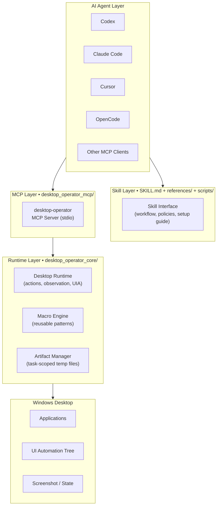

<div align="center">

<br/>

```
 ██████╗██╗   ██╗ █████╗     ██████╗ ███████╗███████╗██╗  ██╗████████╗ ██████╗ ██████╗
██╔════╝██║   ██║██╔══██╗    ██╔══██╗██╔════╝██╔════╝██║ ██╔╝╚══██╔══╝██╔═══██╗██╔══██╗
██║     ██║   ██║███████║    ██║  ██║█████╗  ███████╗█████╔╝    ██║   ██║   ██║██████╔╝
██║     ██║   ██║██╔══██║    ██║  ██║██╔══╝  ╚════██║██╔═██╗    ██║   ██║   ██║██╔═══╝
╚██████╗╚██████╔╝██║  ██║    ██████╔╝███████╗███████║██║  ██╗   ██║   ╚██████╔╝██║
 ╚═════╝ ╚═════╝ ╚═╝  ╚═╝    ╚═════╝ ╚══════╝╚══════╝╚═╝  ╚═╝   ╚═╝    ╚═════╝ ╚═╝
                         ██████╗ ██████╗ ███████╗██████╗  █████╗ ████████╗ ██████╗ ██████╗
                        ██╔═══██╗██╔══██╗██╔════╝██╔══██╗██╔══██╗╚══██╔══╝██╔═══██╗██╔══██╗
                        ██║   ██║██████╔╝█████╗  ██████╔╝███████║   ██║   ██║   ██║██████╔╝
                        ██║   ██║██╔═══╝ ██╔══╝  ██╔══██╗██╔══██║   ██║   ██║   ██║██╔══██╗
                        ╚██████╔╝██║     ███████╗██║  ██║██║  ██║   ██║   ╚██████╔╝██║  ██║
                         ╚═════╝ ╚═╝     ╚══════╝╚═╝  ╚═╝╚═╝  ╚═╝   ╚═╝    ╚═════╝ ╚═╝  ╚═╝
```

### **Windows-first · MCP-native · Agent-neutral**

> One execution layer. Any MCP-capable AI agent. Zero cloud dependency.

<br/>


<br/>

[](#)
[](#)
[](#)
[](./LICENSE)
[](#)

<br/>

<p>
  <a href="./README.md"></a>
  <a href="./README.zh-CN.md"></a>
  <a href="./README.zh-Hant.md"></a>
  <a href="./README.ja.md"></a>
  <a href="./README.ko.md"></a>
</p>

</div>

---

## What Is This?

`CUA Desktop Operator Skill` is a **standalone, clone-ready skill repository** that gives any MCP-capable AI agent a structured way to operate a Windows desktop.

The repository root **is** the skill package — clone it directly into your agent's skills directory and it works.

```
agent (Codex / Claude Code / Cursor / OpenCode / ...)
    └─► MCP Client
            └─► desktop-operator  (local stdio server, this repo)
                     └─► Windows Desktop
```

---

## Why This Exists

Most desktop automation stacks fall into one of two extremes:

| Approach | Problem |
|---|---|
| Brittle scripts | No structured observation model; breaks on any UI change |
| Heavyweight agent systems | Assume a fixed model backend, cloud planner, or custom visual stack |

**CUA Desktop Operator takes a different path:**

| Principle | What it means |
|---|---|
| Reasoning stays in the agent | The AI model decides; the skill just executes |
| Execution stays local | No cloud round-trip, no external visual model required |
| Interface stays standard | MCP tools are the same regardless of which agent calls them |
| Skill stays portable | Clone once, use from Codex, Claude Code, Cursor, or any MCP client |

The result is a practical desktop operator that can be reused by multiple AI clients without rebuilding the execution layer for each one.

---

## Key Capabilities

<table>
<tr>
<td width="50%" valign="top">

### Desktop Control
- Launch applications
- Focus windows by title or index
- Click at absolute or window-relative coordinates
- Send hotkeys and key sequences
- Type and paste text (clipboard-backed for CJK)
- Scroll and explicit wait

</td>
<td width="50%" valign="top">

### Observation-First Workflow
- Full screenshot capture
- Active window detection
- Visible window inventory
- Cropped target-window screenshots
- Bounded UI Automation queries
- Structured JSON state artifacts

</td>
</tr>
<tr>
<td width="50%" valign="top">

### Reusable Macro Layer
- App launch (command, URI, shortcut)
- Search box submit
- Chat panel toggle
- Media play/pause
- Browser address bar focus
- Windows Settings open
- Submit / confirm actions

</td>
<td width="50%" valign="top">

### Cross-Agent Interface
- Codex
- Claude Code
- Cursor
- OpenCode
- Any MCP-capable agent via manual stdio config
- Agent-neutral: same tools, same results, every client

</td>
</tr>
</table>

---

## Architecture



### Layer responsibilities

**Skill layer**
- Tells the agent when and how to use this skill
- Defines the observe → plan → act → verify workflow
- Explains client setup when MCP is not yet configured

**MCP layer**
- Exposes a stable, versioned tool surface over stdio
- Returns structured results identical across all clients
- Handles server lifecycle and connection management

**Runtime layer**
- Performs real desktop actions via Win32 / UI Automation
- Captures screenshots and structured window state
- Manages task-scoped artifacts and post-task cleanup

---

## Repository Layout

```text
cua_desktop_operator_skill/
├── SKILL.md                          ← Agent reads this first
├── README.md                         ← English documentation
├── README.zh-CN.md                   ← Simplified Chinese
├── README.zh-Hant.md                  ← Traditional Chinese
├── README.ja.md                      ← Japanese
├── README.ko.md                      ← Korean
├── LICENSE                           ← GNU AGPL v3.0
├── SECURITY.md
├── agents/
│   └── openai.yaml                   ← Agent manifest (Codex / OpenCode)
├── references/
│   ├── compatibility.md              ← Cross-agent notes
│   ├── failure-recovery.md           ← Recovery patterns
│   ├── interaction-patterns.md       ← Interaction best practices
│   ├── macro-catalog.md              ← Built-in macro reference
│   ├── mcp-client-setup.md           ← Client configuration guide
│   └── mcp-tool-catalog.md           ← Complete MCP tool reference
├── scripts/
│   ├── setup_runtime.ps1             ← Install dependencies
│   ├── start_mcp_server.ps1          ← Launch MCP server
│   ├── verify_real_tasks.ps1         ← Validate skill end-to-end
│   └── verify_real_tasks.py
├── desktop_operator_core/            ← Runtime library
└── desktop_operator_mcp/             ← MCP server package
```

---

## Quick Start

### Step 1 — Clone into your skills directory

```powershell
# For Codex
git clone https://github.com/Marways7/cua_desktop_operator_skill "$HOME\.codex\skills\cua_desktop_operator_skill"

# For Claude Code
git clone https://github.com/Marways7/cua_desktop_operator_skill "$HOME\.claude\skills\cua_desktop_operator_skill"

# For Cursor
git clone https://github.com/Marways7/cua_desktop_operator_skill "$HOME\.cursor\skills\cua_desktop_operator_skill"
```

### Step 2 — Install dependencies

```powershell
.\scripts\setup_runtime.ps1
```

To install into a custom directory explicitly:

```powershell
.\scripts\setup_runtime.ps1 -InstallDir "$HOME\.codex\skills\cua_desktop_operator_skill"
```

### Step 3 — Start the local MCP server

```powershell
.\scripts\start_mcp_server.ps1
```

### Step 4 — Connect your agent

Read [`references/mcp-client-setup.md`](./references/mcp-client-setup.md) for per-client configuration.

That file covers:

| Client | Setup method |
|---|---|
| Codex | `agents/openai.yaml` manifest |
| Claude Code | `.mcp.json` or `settings.json` server entry |
| Cursor | MCP server config in Cursor settings |
| OpenCode | `agents/openai.yaml` manifest |
| Other | Generic stdio payload in the reference file |

### Step 5 — Let the agent operate

Once connected, the agent follows this loop automatically:

```
observe → plan → act → verify → (cleanup)
```

1. Call `desktop_observe` — see the current desktop state
2. Plan the smallest safe next step
3. Execute through MCP
4. Verify the result with `desktop_validate_state`
5. Repeat until done
6. Call `desktop_cleanup_artifacts` on success

---

## MCP Tool Reference

### Observation tools

| Tool | Description |
|---|---|
| `desktop_observe` | Capture full screenshot, active window, window list, optional cropped target image, and JSON state artifact |
| `desktop_get_last_artifacts` | Load latest screenshot, state, execution, and failure artifact paths |
| `desktop_cleanup_artifacts` | Remove task-scoped temporary files after successful task completion |

### Window management

| Tool | Description |
|---|---|
| `desktop_list_windows` | Quick inventory of all visible windows |
| `desktop_find_window` | Find candidate windows by title filter |
| `desktop_focus_window` | Bring a window to foreground before keyboard interaction |
| `desktop_launch_app` | Launch shell command, executable, URI, or shortcut |

### Primitive actions

| Tool | When to use |
|---|---|
| `desktop_click_relative` | **Preferred** — click at a position relative to a target window |
| `desktop_click_absolute` | Last resort — absolute screen coordinates |
| `desktop_send_keys` | Single key or hotkey sequence (`Ctrl+C`, `Alt+F4`, etc.) |
| `desktop_type_text` | Short plain ASCII text |
| `desktop_paste_text` | **Preferred for CJK or long text** — clipboard-backed paste |
| `desktop_scroll` | Scroll the focused area up or down |
| `desktop_wait` | Explicit wait while UI is loading |

### UI Automation

| Tool | Description |
|---|---|
| `desktop_uia_query` | Enumerate UIA controls with optional selectors (text, automation ID, control type) |
| `desktop_uia_click` | Click a UIA control by text, automation ID, or control type |
| `desktop_uia_type` | Focus a UIA control and type into it |

### Workflow tools

| Tool | Description |
|---|---|
| `desktop_run_macro` | Run a built-in macro; use `macro_id="__catalog__"` to list all macros |
| `desktop_validate_state` | Verify that a window or control is present after an action |

Full descriptions: [`references/mcp-tool-catalog.md`](./references/mcp-tool-catalog.md)

---

## Macro Catalog

Macros encode stable, reusable GUI patterns. Prefer them over raw primitives for well-known flows.

| Macro ID | Category | Purpose |
|---|---|---|
| `app_launch` | App launch | Launch app by command, URI, or executable |
| `desktop_shortcut_launch` | App launch | Launch via `.lnk` shortcut path |
| `search_box_submit` | Search | Focus search box, type query, submit |
| `chat_panel_toggle` | Chat | Toggle chat panel by hotkey or relative click |
| `media_play_pause` | Media | Send play/pause key to media player |
| `browser_focus_address_bar` | Browser | Focus browser address bar via shortcut |
| `submit_or_confirm` | Confirm | Press submit / confirm key sequence |
| `open_windows_settings` | Settings | Open Windows Settings app |

Full descriptions: [`references/macro-catalog.md`](./references/macro-catalog.md)

---

## Design Principles

| Principle | Details |
|---|---|
| **Agent-neutral** | One execution layer, many clients — the same MCP tools serve every agent without modification |
| **Local-first** | No required cloud planner; no required external visual model; runs entirely on the local machine |
| **Observe before acting** | Every interaction loop starts with `desktop_observe`; never act blind |
| **Small, safe steps** | Keep each action bounded; prefer reversible actions; validate after every mutation |
| **Reusable over brittle** | Use macros for repeatable patterns; fall back to primitives only when needed |
| **Portable by default** | No hardcoded machine paths; no user-profile assumptions; no repo-local artifact dependencies |

---

## Recommended Workflow for Agents

```
1.  Verify that the desktop-operator MCP server is connected.
    └─ If not: follow references/mcp-client-setup.md before proceeding.

2.  Call desktop_observe.
    └─ Inspect: screenshot path, active window, visible windows, optional cropped image.

3.  Choose the smallest next action using this priority order:
    desktop_focus_window            → before keyboard input
    desktop_run_macro               → for any recognized reusable pattern
    desktop_click_relative          → for stable window-relative positions
    desktop_uia_click / uia_type    → when a reliable UIA control is visible
    desktop_click_absolute          → last resort

4.  Execute the action.

5.  Call desktop_observe or desktop_validate_state to confirm the result.

6.  Repeat from step 2 until the success condition is satisfied.

7.  Call desktop_cleanup_artifacts.
    └─ Skip only if the user explicitly asked to keep debug traces.
```

---

## Portability and Privacy

This repository is prepared for open-source distribution.

### What was removed

- Hardcoded local Windows paths
- Hardcoded user-profile references
- Repo-local runtime output assumptions
- Legacy upstream directories unrelated to the final skill package

### Artifact behavior

Task screenshots, JSON state files, and execution logs are treated as **temporary artifacts** by default.

| Property | Value |
|---|---|
| Default storage | `%LOCALAPPDATA%\desktop-operator\artifacts` (Windows) / system temp (fallback) |
| Scope | Current task session only |
| Cleanup | Agent calls `desktop_cleanup_artifacts` after success |
| Override | Set `DESKTOP_OPERATOR_ARTIFACTS` environment variable |

Artifacts are **never** committed back to the repository.

---

## Validation

Run the built-in validation script to confirm the skill is working end-to-end:

```powershell
.\scripts\verify_real_tasks.ps1 --task observe
```

Available validation targets:

| Target | What it tests |
|---|---|
| `observe` | Screenshot capture and window detection |
| `notepad` | Launch, type, save in Notepad |
| `browser` | Browser address bar and navigation |
| `settings` | Open Windows Settings |
| `media` | Media play/pause via macro |
| `chat` | Chat panel toggle via macro |
| `all` | Run all targets in sequence |

To keep artifacts for inspection after validation:

```powershell
.\scripts\verify_real_tasks.ps1 --task all --keep-artifacts
```

---

## Provenance

This project was shaped by studying public desktop-agent work, especially:

- [microsoft/cua_skill](https://github.com/microsoft/cua_skill)
- [bytedance/UI-TARS-desktop](https://github.com/bytedance/UI-TARS-desktop)

The released working tree contains this repository's own runtime, MCP server, and skill files rather than the original upstream source trees.

---

## License

This project is distributed under the [GNU Affero General Public License v3.0](./LICENSE).

AGPL is used here so that redistributed or hosted modified versions remain open under the same license.

---

## Star History

[](https://star-history.com/#Marways7/cua_desktop_operator_skill&Date)
